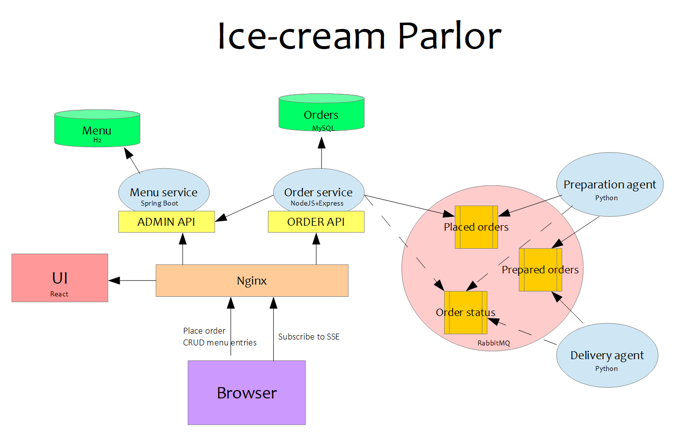
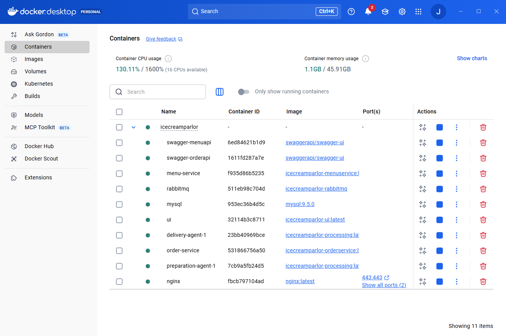
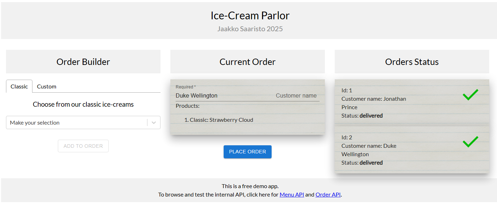

# Ice-cream Parlor - RESTful Microservices Demo App

Jaakko Saaristo 2025

Ice-cream Parlor is a demo business application and a microservice technology showcase.
The application is composed of a frontend and an event-based backend of containerized scalable microservices.
The microservices are each built with different technologies.

Ice-cream Parlor provides a backend and a simple UI to buy, process and deliver ice-cream.

## Technical Aspects

### Technologies featured:

1. OpenAPI specification
2. Docker, Docker Compose
3. React
4. Spring Boot, Spring Web, Spring JPA
5. Node.JS
6. Python
7. RabbitMQ
8. PostgreSQL
9. Nginx

### Architecture



### API Specification

Menu operations utilize the Menu service over Menu API. Order operations utilize the Order service over Order API.

When running the app, the APIs are blocked from external network traffic, but 
the OpenAPI specifications can be browsed and tested through the Swagger pages.
The Swagger pages are made public for demo purposes.

You can access the Swagger *from the links in the page footer*. The API served by the Swagger pages is generated from
the specifications in this repository under *api-specifications/*.

### Scalability

In this setup, all services are set up to be served by a single microservice. The architecture supports horizontal scaling of
service nodes, using e.g. Kubernetes.

### Security

The services run inside a Docker virtual network. The service ports are not exposed to the outside world.
They can be exposed by un-commenting a few lines in *docker-compose.yaml*

Inter-service communication is implemented over RabbitMQ and HTTPS with SSL using a self-signed certificate.
Public access is only allowed through a HTTP(s) reverse proxy (Nginx).

There is no user management. RabbitMQ and MySQL use password authentication.


## Project Structure

This repository is an *aggregator* project of the following microservice repositories:
- IceCreamParlor
- IceCreamParlor-MenuService
- IceCreamParlor-OrderService
- IceCreamParlor-Processing
- icecreamparlor-ui

To run Icecream-parlor locally you only need to pull this repository.

In this composition, the app is set up to run locally in a single host machine.

## Requirements

To run Ice-cream Parlor on your local machine, you need the following.

- Internet connection (once services are built into Docker repository, its not anymore needed)
- Linux-like environment (Linux, Mac or Windows with e.g. Git Bash)
- Docker
- Docker Desktop is running

Note: Docker requires virtualization support at system level. This is a configuration option in BIOS.
Docker Desktop installation will prompt you to this.

## Configuring

### Configuring Passwords

Before running the app, you need to provide a couple of passwords. You can use any arbitrary values for the passwords, as this is a demo application.
The passwords will be baked into the services and used to authenticate inter-service communication.

1. Create a copy of the `.env.template` file, in the same directory as the template
2. Rename the file to `.env` ("dot env", notice the filename starts with a dot)
3. Edit the `.env` file and fill in the blanks

## Building

The build script will pull all custom built microservices from my Github and build them into Docker images in the local Docker repository.

To build the app, run `./build-microservices`

## Running and stopping

### Running

To start the app, run

```
docker compose up
```

This will run all microservices in Docker Desktop using configuration in `docker-compose.yaml`, and aggregate all log output to console.
The full service composition contains the custom microservices built in the previous step, and
some publicly available service images.
Docker Compose will run each of these, using health checks to secure the starting order.

Once the service is successfully up and running, your Docker Desktop panel should look like this,
with all services running and port 443 open at *nginx* service.



### Stopping

Go to Docker Desktop. Click on the tab "Containers". Click the stop button on the top level service "icecreamparlor".

## Using the App

Direct your chosen browser to https://localhost.

Because this is a locally run demo app, only a poor man's *self-signed SSL certificate* is available at the Nginx web server.
Your browser will call it unsafe, unless you teach it not to (which is not covered here).
This is just a cosmetic problem. You'll see something like this:


Also, you might get an error page and have to specifically ask your browser to let you through the first time.

You use the UI to create ice-cream orders.



On the left panel, you can start a new order. Then you can choose between tabs to add items to your order.

On the middle panel, you see the current order being built. You can remove items from the order by clicking
on them. You need to enter a name in order to be able to place your order.
Once you're happy with your order, click "Place order".

On the right panel, you see existing orders and their status. Hover your mouse on them to expand their content.

Once an order is created, in the backend it will be placed in the queue for placed orders.
After a moment, it will get picked up by a preparation agent, and once it's prepared, it will be placed in the queue for prepared orders.
It will then be picked up by a delivery agent and delivered. At each processing step, the order
status is updated using the order status queue. These status updates are listened to by the Order service,
which will update the order status in its internal database, and push the status updates to the UI.
The UI will display the progress of each order to the user.

The Menu service is serving built-in menu items from its database. The API also provides administration functions
to add and delete menu items. There is no UI functionality to support these features.
